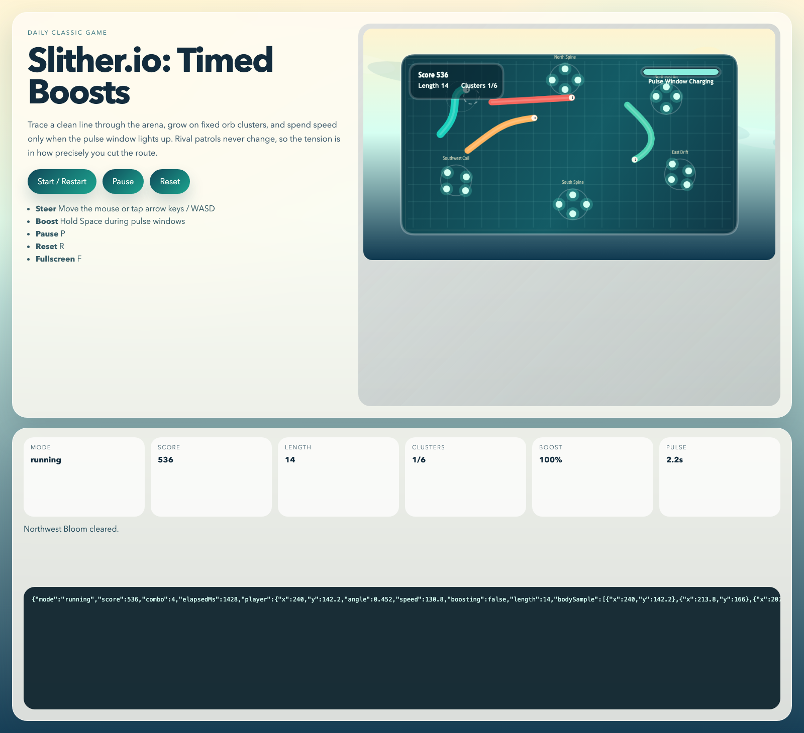
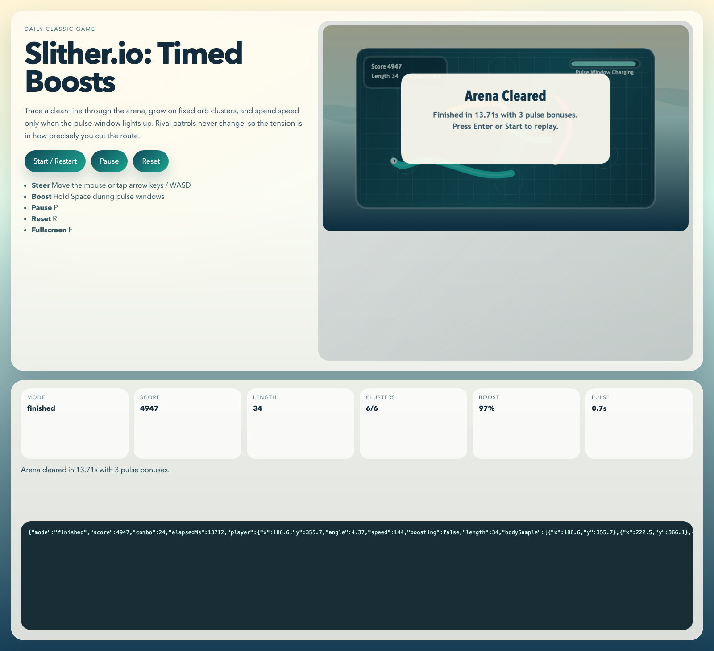

# daily-classic-game-2026-05-15-slither-io-timed-boosts

<p align="center"><strong>A deterministic Slither.io-inspired arena run where boost windows open on a fixed cadence, rival snakes patrol readable routes, and a proof-friendly finish lets automation verify growth, scoring, pause, reset, and collision rules.</strong></p>

<p align="center">
  
  
</p>

## Quick Start

```bash
pnpm install
pnpm test
pnpm build
pnpm capture
pnpm dev
```

## How To Play

- Press `Enter` or click `Start / Restart` to begin.
- Move the mouse to steer the snake head toward a target point.
- Hold `Space` for a timed speed boost when charge is available.
- Press `P` to pause and `R` to reset to the title state.

## Rules

- Grow by collecting energy orbs before rival snakes sweep them away.
- Rival snakes follow deterministic patrol loops and cause an instant wipe if you hit a rival body or the arena wall.
- Boosting increases speed but drains the shared boost meter.
- The run ends in victory after the target length and score thresholds are both met.

## Scoring

- Each orb grants base score plus a small chain bonus.
- Boost pickups and efficient route clears add timed bonuses.
- Finishing with unused boost charge grants a closing efficiency bonus.

## Twist

`timed boosts`

Boost charge refills in visible pulses. Strong runs depend on spending speed bursts only when the refill window and the arena line up, rather than holding boost constantly.

## Verification

- `pnpm test`
- `pnpm build`
- `pnpm capture`
- Browser hooks:
  `window.advanceTime(ms)` advances the deterministic simulation.
  `window.render_game_to_text()` returns the current arena state as JSON text.
- Capture artifacts and proof numbers are generated after verification finishes.

## GIF Captures

- `Arena opening`: `assets/gifs/clip-01-arena-opening.gif`
- `Boost corridor`: `assets/gifs/clip-02-boost-corridor.gif`
- `Finish banner`: `assets/gifs/clip-03-finish-banner.gif`

## Project Layout

```text
src/                 deterministic simulation, autopilot helper, and renderer
scripts/             self-check and Playwright capture entry points
tests/               Node-based simulation assertions
artifacts/playwright/ screenshots, state dumps, action payload, and logs
assets/gifs/         exported GIF clips for the README
docs/plans/          run-local implementation plan
```
